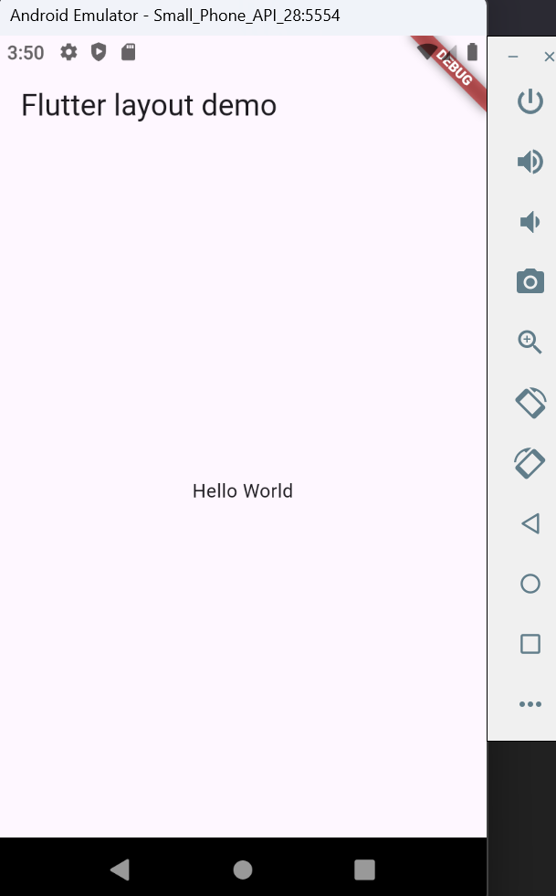

# Jobsheet 6 Layout_Flutter

A new Flutter project.

Nama : Agta Fadjrin Aminullah
Kelas : SIB 3E
Absen : 03
NIM : 2241760072

## Praktikum 1

### Langkah 1: Buat Project Baru

Buatlah sebuah project flutter baru dengan nama layout_flutter. Atau sesuaikan style laporan praktikum yang Anda buat.

### Langkah 2: Buka file lib/main.dart

Buka file main.dart lalu ganti dengan kode berikut. Isi nama dan NIM Anda di text title

### Langkah 3: Identifikasi layout diagram

Setelah tata letak telah dibuat diagramnya, cara termudah adalah dengan menerapkan pendekatan bottom-up. Untuk meminimalkan kebingungan visual dari kode tata letak yang banyak bertumpuk, tempatkan beberapa implementasi dalam variabel dan fungsi.

### Langkah 4: Implementasi title row

Pertama, Anda akan membuat kolom bagian kiri pada judul. Tambahkan kode berikut di bagian atas metode build() di dalam kelas MyApp:

/* soal 1 */ Letakkan widget Column di dalam widget Expanded agar menyesuaikan ruang yang tersisa di dalam widget Row. Tambahkan properti crossAxisAlignment ke CrossAxisAlignment.start sehingga posisi kolom berada di awal baris.

/* soal 2 */ Letakkan baris pertama teks di dalam Container sehingga memungkinkan Anda untuk menambahkan padding = 8. Teks ‘Batu, Malang, Indonesia' di dalam Column, set warna menjadi abu-abu.

/* soal 3 */ Dua item terakhir di baris judul adalah ikon bintang, set dengan warna merah, dan teks "41". Seluruh baris ada di dalam Container dan beri padding di sepanjang setiap tepinya sebesar 32 piksel. Kemudian ganti isi body text ‘Hello World' dengan variabel titleSection seperti berikut:

Hasil Pengerjaan : 

#### Analisa : 
widget Column digunakan agar menyesuaikan ruang yang tersisa di dalam widget Row. Sedangkan properti crossAxisAlignment ke CrossAxisAlignment.start digunakan untuk mengembalikan posisi kolom berada di awal baris. Terdapat judul tempat wisata yaitu "Wisata Gunung di Batu" dengan tulisan yang tebal, teks kecil berwarna abu-abu yang bilang lokasinya di "Batu, Malang, Indonesia", ikon bintang merah dan angka 41 di sebelah kanan. Artinya, tempat wisata ini punya 41 rating bintang!.

## Praktikum 2: Implementasi button row

### Langkah 1: Buat method Column _buildButtonColumn

Bagian tombol berisi 3 kolom yang menggunakan tata letak yang sama—sebuah ikon di atas baris teks. Kolom pada baris ini diberi jarak yang sama, dan teks serta ikon diberi warna primer.

Karena kode untuk membangun setiap kolom hampir sama, buatlah metode pembantu pribadi bernama buildButtonColumn(), yang mempunyai parameter warna, Icon dan Text, sehingga dapat mengembalikan kolom dengan widgetnya sesuai dengan warna tertentu.

### Langkah 2: Buat widget buttonSection
Buat Fungsi untuk menambahkan ikon langsung ke kolom. Teks berada di dalam Container dengan margin hanya di bagian atas, yang memisahkan teks dari ikon.

Bangun baris yang berisi kolom-kolom ini dengan memanggil fungsi dan set warna, Icon, dan teks khusus melalui parameter ke kolom tersebut. Sejajarkan kolom di sepanjang sumbu utama menggunakan MainAxisAlignment.spaceEvenly untuk mengatur ruang kosong secara merata sebelum, di antara, dan setelah setiap kolom. Tambahkan kode berikut tepat di bawah deklarasi titleSection di dalam metode build():

lib/main.dart (buttonSection)

### Langkah 3: Tambah button section ke body

Tambahkan variabel buttonSection ke dalam body

Hasil Pengerjaan : 

#### Analisa : 

Ada penambahan tiga tombol pada praktikum ini yaitu CALL untuk menelpon, ROUTE untuk mencari rute ke tempat wisata, dan SHARE untuk membagikan informasi ini ke teman-teman.
Tiap tombol ada gambarnya (ikon) dan tulisan di bawahnya. Misalnya, ikon telepon untuk tombol CALL.

## Praktikum 3: Implementasi text section

### Langkah 1: Buat widget textSection

Tentukan bagian teks sebagai variabel. Masukkan teks ke dalam Container dan tambahkan padding di sepanjang setiap tepinya. Tambahkan kode berikut tepat di bawah deklarasi buttonSection

### Langkah 2: Tambahkan variabel text section ke body

Tambahkan widget variabel textSection ke dalam body

Hasil Pengerjaan : 

#### Analisa : 

Setelah melakukan penambahan tombol-tombolnya, ada paragraf yang menceritakan tentang tempat wisata ini. saya mengambil deskripsi panjang yang menjelaskan alamat dan jam buka, serta harga tiket masuk dengan sumber kompas.com. Di bagian akhir saya menulis nama dan NIM saya sebagai bukti pengerjaan saya.

## Praktikum 4: Implementasi image section

### Langkah 1: Siapkan aset gambar

Anda dapat mencari gambar di internet yang ingin ditampilkan. Buatlah folder images di root project layout_flutter. Masukkan file gambar tersebut ke folder images, lalu set nama file tersebut ke file pubspec.yaml.

### Langkah 2: Tambahkan gambar ke body

Tambahkan aset gambar ke dalam body.

### Langkah 3: Terakhir, ubah menjadi ListView

Pada langkah terakhir ini, atur semua elemen dalam ListView, bukan Column, karena ListView mendukung scroll yang dinamis saat aplikasi dijalankan pada perangkat yang resolusinya lebih kecil.

#### Analisa : 
Semua bagian tadi ditaruh dalam satu daftar besar (ListView) sehingga kita bisa scroll layar ke atas dan ke bawah untuk melihat seluruh informasi.